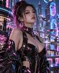

# MuseForge

> Open-source AI Beauty Prompt Engineering Platform

MuseForge focuses on one thing: **building better prompts for AI beauty portrait creation**.

It combines structured appearance attributes, cultural and fashion references, clothing, scenes, seasons, poses, lighting, camera language, and reusable prompt examples into an open dataset, API, and visual prompt studio.

## Showcase


The Gallery currently contains **50 fictional adult beauty concepts** across cultural fashion, modern style, seasonal scenes, professional portraits, lifestyle, fantasy, illustration, and science fiction.

| Chinese Hanfu | Japanese Kimono | French Elegance |
| --- | --- | --- |
|  |  |  |

| Italian Luxury | Fantasy Goddess | Cyber Beauty |
| --- | --- | --- |
|  |  |  |

See the [Gallery Guide](./docs/GALLERY.md) and the machine-readable [Gallery Manifest](./dataset/gallery_manifest.json).

## What works now

- ✅ 50-style visual Gallery dataset
- ✅ Searchable/filterable React Gallery
- ✅ Gallery detail view with prompt and negative prompt
- ✅ One-click prompt copy
- ✅ Send Gallery concepts into Prompt Studio
- ✅ FastAPI Gallery endpoints
- ✅ Prompt generation MVP endpoint
- ✅ Docker setup for API + Web
- ✅ CI validation for frontend, backend, and manifest consistency

## Core dimensions

- Countries, regions, and cultural references
- Beauty styles and appearance attributes
- Hairstyles and makeup
- Clothing and accessories
- Seasons, environments, and scenes
- Poses, expressions, and moods
- Photography, lenses, composition, and lighting
- Fantasy, illustration, and sci-fi styles
- Prompt generation and recommendation

## Quick start

### Docker

```bash
docker compose up --build
```

Then open:

- Web Studio: http://localhost:3000
- API health: http://localhost:8000/health
- API docs: http://localhost:8000/docs
- Gallery API: http://localhost:8000/api/v1/gallery

### Web only

```bash
cd web
npm install
npm run dev
```

### API only

```bash
cd backend
pip install -r requirements.txt
uvicorn main:app --reload --port 8000
```

## API examples

```text
GET /api/v1/gallery
GET /api/v1/gallery?category=fantasy
GET /api/v1/gallery?q=cyber
GET /api/v1/gallery/44-cyberpunk
POST /api/v1/prompt/generate
```

## Project structure

```text
MuseForge/
├── assets/showcase/     # Repository showcase images
├── dataset/             # Source-of-truth prompt datasets
├── examples/            # Prompt examples
├── docs/                # Architecture and contribution docs
├── backend/             # FastAPI service
├── app/                 # Prompt engine modules
└── web/                 # React + TypeScript Web Studio
```

## Roadmap

- Expand from 50 to 100+ curated gallery concepts
- Replace sprite-only previews with individually versioned showcase assets where useful
- Connect all prompt dimensions to the generator
- Add recommendation, similarity search, and favorites
- Add model-specific prompt adapters for Midjourney, Stable Diffusion, Flux, and other image models
- Add schema validation, API tests, and visual regression tests
- Add community submissions and moderation workflow

## Contributing

Contributions are welcome. Please read [CONTRIBUTING.md](./CONTRIBUTING.md) and [DATA_CONTRIBUTION_GUIDE.md](./docs/DATA_CONTRIBUTION_GUIDE.md).

## Gallery note

Showcase people are fictional AI-generated adults. Cultural or geographic labels are prompt inspiration dimensions rather than claims about how people from a place, culture, or ethnicity look.

## License

MIT License
