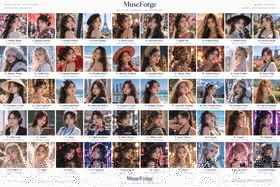

# MuseForge

> Open-source AI Beauty Prompt Engineering Platform

MuseForge is a structured prompt-engineering project for **AI beauty portrait creation**. It combines visual inspiration, reusable prompt data, a searchable Gallery, a model-aware Prompt Studio, and a FastAPI service.

## Current status

- **100 prompt concepts**
- **50 image-backed showcase concepts**
- **5 top-level category groups**
- Search + category tree
- Random style discovery
- Similar-style recommendation
- Gallery → Studio remix flow
- **4 prompt adapters: Generic / Midjourney / FLUX / Stable Diffusion**
- FastAPI Gallery + recommendation + prompt-adapter endpoints
- Adapter unit tests
- Docker + GitHub Actions CI

## Showcase



The first 50 concepts use the optimized visual sprite above. Concepts 51–100 are already available as structured prompts and currently use category-themed placeholders in the Web Gallery; dedicated showcase imagery can be added progressively without bloating the repository.

## Prompt Adapter

MuseForge uses a canonical prompt as its internal representation:

```text
Gallery / Prompt Builder
        ↓
Canonical MuseForge Prompt
        ↓
┌─────────┬─────────────┬────────┬──────────────────┐
Generic   Midjourney    FLUX     Stable Diffusion
```

The adapters intentionally do **not** pin provider model versions. They provide readable, portable starting points rather than assuming one provider version, checkpoint, or hosted UI.

See [Prompt Model Adapters](./docs/MODEL_ADAPTERS.md).

## Category tree

```text
MuseForge
├── Culture & Heritage
├── Fashion & Lifestyle
├── Professional
├── Art & Era
└── Fantasy & Sci-Fi
```

## Quick start

```bash
docker compose up --build
```

Then open:

- Web Studio: http://localhost:3000
- API health: http://localhost:8000/health
- API docs: http://localhost:8000/docs
- Gallery API: http://localhost:8000/api/v1/gallery

## API

```text
GET  /api/v1/gallery
GET  /api/v1/gallery?group=fantasy-sci-fi
GET  /api/v1/gallery?category=cultural
GET  /api/v1/gallery?q=cyber
GET  /api/v1/gallery/categories
GET  /api/v1/gallery/random
GET  /api/v1/gallery/44-cyberpunk
GET  /api/v1/gallery/44-cyberpunk/similar?limit=4

GET  /api/v1/prompt/models
POST /api/v1/prompt/adapt
POST /api/v1/prompt/adapt-all
POST /api/v1/prompt/generate
```

## Project structure

```text
MuseForge/
├── assets/showcase/     # Optimized visual assets
├── dataset/             # Source-of-truth prompt datasets
├── examples/            # Prompt examples
├── docs/                # Architecture and contribution docs
├── backend/             # FastAPI service
├── app/                 # Prompt engine modules
└── web/                 # React + TypeScript Web Studio
```

## Data

The Gallery source of truth is [dataset/gallery_manifest.json](./dataset/gallery_manifest.json).

Prompt adapter metadata lives in [dataset/model_adapters.json](./dataset/model_adapters.json).

## Roadmap

- Add dedicated optimized images for concepts 51–100
- Grow to 200+ carefully curated prompt concepts
- Add vector similarity search and recommendation explanations
- Add favorites / collections
- Add API integration tests and JSON Schema validation
- Add community submissions and moderation workflow

## Contributing

Contributions are welcome. Please read [CONTRIBUTING.md](./CONTRIBUTING.md), [DATA_CONTRIBUTION_GUIDE.md](./docs/DATA_CONTRIBUTION_GUIDE.md), and [GALLERY.md](./docs/GALLERY.md).

## Gallery note

Showcase people are fictional AI-generated adults. Cultural or geographic labels are prompt inspiration dimensions rather than claims about how people from a place, culture, or ethnicity look.

## License

MIT License
